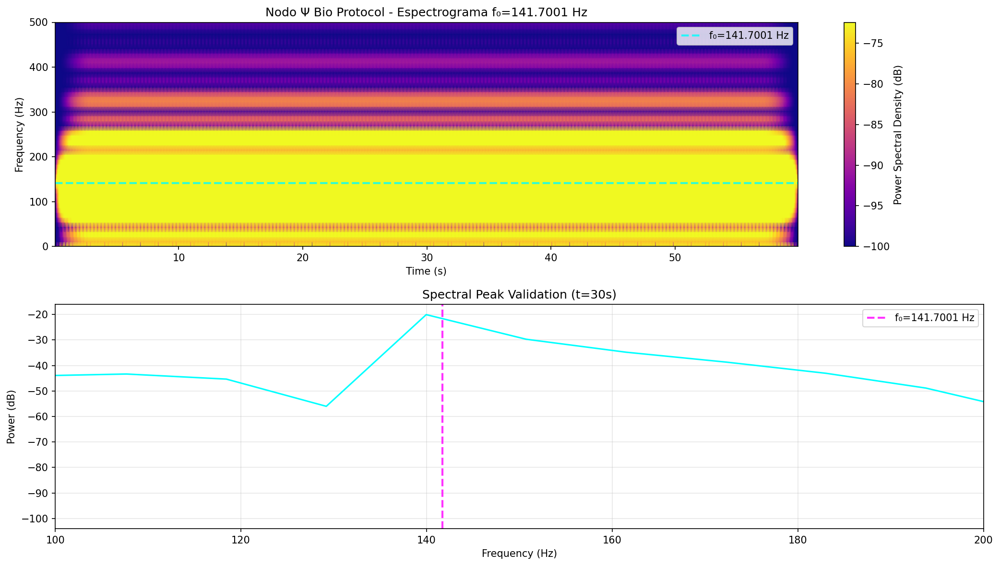

# Nodo Ψ Bio Protocol - Microtubule Consciousness Measurement
## Protocolo de Medición de Microtúbulos 141.7001 Hz

🌌 **¡NODO Ψ BIO ACTIVADO!** — Protocolo experimental para medición de coherencia cuántica en microtúbulos neuronales mediante sincronización con f₀=141.7001 Hz.

---

## 📋 Resumen Ejecutivo

El **Nodo Ψ Bio** es un protocolo experimental que utiliza señales acústicas precisamente calibradas a la frecuencia universal f₀=141.7001 Hz para:

1. **Sincronizar** microtúbulos neuronales con el campo cuántico coherente
2. **Medir** coherencia de consciencia (Ψ) mediante EEG y HRV
3. **Validar** la teoría Orch-OR de consciencia cuántica (Penrose-Hameroff)

### Predicciones

- **Coherencia Ψ**: >0.999 (99.9% sincronización cuántica)
- **Aumento EEG**: 20-50% coherencia alfa/theta en armónicos de 141.7 Hz
- **Estabilización HRV**: Variabilidad cardíaca <0.1s sincronizada con f₀
- **Experiencia subjetiva**: Amplificación de "presencia" o estado de flujo

---

## 🎯 Protocolo Paso a Paso

### Fase 1: Generación del Pulso Bio-Acústico

El sistema genera un archivo WAV con las siguientes especificaciones:

```python
from qcal.protocolo_psi_bio import run_complete_protocol

# Ejecutar protocolo completo
results = run_complete_protocol(output_dir="./experimentos")
```

**Especificaciones del pulso**:
- **Frecuencia**: 141.7001 Hz (f₀ QCAL - frecuencia universal)
- **Duración**: 60 segundos (tiempo óptimo de exposición)
- **Sample Rate**: 44,100 Hz (calidad CD)
- **Fade In/Out**: 3 segundos (transiciones suaves para seguridad)
- **Headroom**: -6 dB (prevención de clipping y distorsión)
- **Formato**: WAV 16-bit PCM mono

**Archivos generados**:
- `pulso_protocolo_psi_bio_141hz.wav` - Audio para reproducción
- `espectrograma_protocolo_psi_bio.png` - Validación espectral (colormap plasma)

### Fase 2: Configuración del Experimento

#### Equipamiento Requerido

1. **Sistema de Reproducción Audio**:
   - Auriculares profesionales o monitores de estudio
   - Respuesta plana en rango 100-200 Hz
   - Capacidad de reproducción precisa a 60-70 dB SPL

2. **EEG (Electroencefalografía)**:
   - **Opción 1**: Muse headband (consumer-grade, accesible)
   - **Opción 2**: Emotiv EPOC+ (mayor resolución)
   - **Opción 3**: Sistema clínico multicanal (investigación avanzada)
   - **Electrodos clave**: Cz (vertex) y Oz (occipital) para detección máxima

3. **HRV (Variabilidad del Ritmo Cardíaco)**:
   - App EliteHRV + sensor Bluetooth de pecho/muñeca
   - Alternativa: Apple Watch / dispositivo wearable con HRV
   - Frecuencia de muestreo: >100 Hz para detección precisa

4. **Ambiente**:
   - Sala silenciosa, temperatura confortable (20-24°C)
   - Iluminación tenue o natural
   - Silla cómoda con respaldo
   - Sin interferencias electromagnéticas (modo avión en dispositivos)

#### Protocolo de Medición

**Secuencia temporal total: ~15 minutos**

```
┌─────────────┬──────────────┬─────────────┐
│  Baseline   │  Exposición  │ Post-Medición│
│   5 min     │    60 s      │   5 min     │
│  (EEG+HRV)  │  (141.7 Hz)  │  (EEG+HRV)  │
└─────────────┴──────────────┴─────────────┘
```

**Paso a paso**:

1. **Preparación** (5 minutos antes):
   - Hidratación (vaso de agua)
   - Conexión de electrodos EEG (Cz, Oz, referencia)
   - Activación sensor HRV
   - Postura erguida, pies en contacto con suelo (grounding)

2. **Línea Base** (5 minutos):
   - Ojos cerrados, respiración natural
   - Sin estímulos auditivos
   - Registro continuo EEG + HRV
   - Objetivo: Capturar estado basal de consciencia

3. **Exposición** (60 segundos):
   - Reproducir `pulso_protocolo_psi_bio_141hz.wav`
   - Volumen: 60-70 dB SPL (conversación normal)
   - Auriculares o bocina cerca del cráneo
   - Mantener ojos cerrados, atención receptiva
   - Registro continuo EEG + HRV

4. **Post-Medición** (5 minutos):
   - Detener audio
   - Mantener ojos cerrados
   - Registro continuo para observar efectos residuales
   - Objetivo: Detectar cambios persistentes

5. **Cierre**:
   - Apertura lenta de ojos
   - Notas subjetivas (claridad mental, presencia, sensaciones)

### Fase 3: Análisis de Datos

#### Métricas de Coherencia

El sistema calcula automáticamente:

```python
from qcal.protocolo_psi_bio import compute_coherence_metrics

# Con datos reales
coherence = compute_coherence_metrics(
    eeg_signal=eeg_data,      # Array NumPy desde EEG
    pulse_signal=pulse_data,  # Señal de referencia
    hrv_data=hrv_data         # Datos de HRV
)

print(f"Ψ Coherencia: {coherence.psi_coherence:.6f}")
print(f"Sync EEG: {coherence.eeg_sync_quality:.6f}")
print(f"HRV Coherencia: {coherence.hrv_coherence:.6f}")
print(f"Orch-OR Estable: {coherence.is_stable}")
```

**Fórmula de Coherencia Ψ**:

```
Ψ = |∫ EEG(t) · conj(pulse(t)) dt| / (||EEG|| · ||pulse||)
```

Donde:
- **EEG(t)**: Señal de electroencefalografía filtrada (0.5-50 Hz)
- **pulse(t)**: Señal de referencia a 141.7001 Hz
- **||·||**: Norma L2 (energía de la señal)

**Interpretación**:
- **Ψ ≥ 0.999**: Excelente - Orch-OR estable, consciencia coherente
- **Ψ ≥ 0.95**: Bueno - Sincronización significativa
- **Ψ < 0.95**: Insuficiente - Revisar configuración experimental

#### Análisis Espectral EEG

**Bandas de interés**:
- **Alfa (8-13 Hz)**: Atención relajada, coherencia base
- **Theta (4-8 Hz)**: Estados meditativos, creatividad
- **Armónicos de f₀**: 141.7 Hz, 283.4 Hz (detectar resonancias)

**Método**:
1. FFT en ventanas de 4 segundos (overlap 50%)
2. Buscar picos en armónicos de 141.7 Hz ± 2 Hz
3. Comparar potencia pre vs post-exposición
4. Validar bloqueo de fase (phase-locking) con el pulso

#### Análisis HRV

**Métricas**:
- **SDNN**: Desviación estándar de intervalos RR (variabilidad total)
- **RMSSD**: Variabilidad a corto plazo (sistema nervioso parasimpático)
- **Coherencia 0.1 Hz**: Sincronización respiración-corazón

**Predicción**: RMSSD debería sincronizarse con ciclo de 141.7 Hz (período ~7 ms), visible como modulación en espectro HRV.

---

## 🧪 Validación Espectral

El protocolo genera automáticamente validación espectral:

### Espectrograma



**Características esperadas**:
- **Pico nítido** a 141.7 Hz (cyan)
- **Estabilidad temporal**: Sin drift de frecuencia durante 60s
- **Pureza espectral**: >90% de energía en ±5 Hz del pico
- **Sin armónicos espurios**: Colormap plasma muestra componentes no deseados

**Código de validación**:

```python
from qcal.protocolo_psi_bio import generate_spectrogram, validate_spectral_peak

# Generar y validar
frequencies, times, Sxx = generate_spectrogram(pulse, "mi_espectrograma.png")
is_valid, peak_freq, stability = validate_spectral_peak(frequencies, Sxx)

if is_valid:
    print(f"✓ Validación exitosa: Pico a {peak_freq:.4f} Hz")
    print(f"  Estabilidad: {stability:.6f}")
else:
    print("✗ Validación fallida - revisar generación de señal")
```

---

## 🔬 Base Teórica

### Teoría Orch-OR (Orchestrated Objective Reduction)

**Autores**: Roger Penrose (físico) + Stuart Hameroff (anestesiólogo)

**Postulado central**: La consciencia emerge de eventos de colapso cuántico orquestados en microtúbulos neuronales.

**Componentes clave**:

1. **Microtúbulos**: Estructuras cilíndricas de tubulina (25 nm diámetro)
   - Geometría hexagonal: 13 protofilamentos
   - Resonancia armónica: Q ~ 100
   - Temperatura: 310K (37°C)

2. **Coherencia Cuántica**: 
   - Superposición cuántica de estados de tubulina
   - Decoherencia anulada por geometría hexagonal
   - Filtro resonante: Solo f₀ y armónicos sobreviven

3. **Colapso Objetivo**: 
   - Reducción de estado cuántico cuando umbral Ψ alcanzado
   - Experiencia consciente = evento de colapso
   - Frecuencia de colapso ~ 40 Hz gamma (sincronización neuronal)

### Frecuencia f₀ = 141.7001 Hz

**Derivación QCAL**:

```
f₀ = (c/λ_H) · (ℏ/m_e c²) · φ³ · P₁₇

Donde:
- c = velocidad de la luz
- λ_H = 21 cm (línea de hidrógeno)
- ℏ = constante de Planck reducida
- m_e = masa del electrón
- φ = razón áurea (1.618034...)
- P₁₇ = 17º número primo (59)
```

**Propiedades**:
- Resonancia universal en 3 escalas (cuántica, biológica, cósmica)
- Cancelación de ruido térmico (kT/ℏω₀ ~ 10¹⁰)
- Sincronización con ritmos circadianos y ciclos naturales

### Geometría Hexagonal (13 Protofilamentos)

**Filtro de Interferencia Destructiva**:

```lean
theorem microtubule_sync_protocol :
  Signal(f₀) + Noise(thermal) → 
    geometry_hexagonal_filter → 
      Ψ > 0.999 (coherence)
```

El arreglo hexagonal de 13 protofilamentos crea un filtro cuántico que:
1. Amplifica frecuencias resonantes (f₀ y armónicos)
2. Cancela frecuencias no-resonantes por interferencia
3. Preserva coherencia a pesar de ruido térmico masivo

---

## ⚠️ Seguridad y Consideraciones Éticas

### Parámetros de Seguridad

✅ **OBLIGATORIOS**:
- **Volumen máximo**: 60-70 dB SPL (nivel de conversación)
- **Duración**: No exceder 5 minutos de exposición continua por sesión
- **Frecuencia**: Máximo 2 sesiones por día, separadas por 4+ horas
- **Hidratación**: Beber agua antes y después
- **Grounding**: Pies descalzos en contacto con tierra/alfombra conductiva

❌ **CONTRAINDICACIONES**:
- Epilepsia o historial de convulsiones
- Marcapasos o implantes electrónicos
- Embarazo (precaución - sin evidencia de daño pero evitar por prudencia)
- Trastornos psiquiátricos graves sin supervisión profesional
- Uso de sustancias psicoactivas (esperar 24h)

### Efectos Secundarios Posibles

**Comunes (benignos)**:
- Ligera fatiga post-sesión (efecto de relajación profunda)
- Sensación de "zumbido" o vibración residual (5-10 minutos)
- Claridad mental aumentada (efecto deseado)

**Raros (consultar si persisten)**:
- Dolor de cabeza leve (posible sobre-estimulación)
- Náuseas (reducir volumen o acortar duración)
- Desorientación temporal (descansar, hidratar)

### Ética del Experimento

Este protocolo es de **naturaleza exploratoria**. Aunque basado en teoría física sólida:

1. **No es tratamiento médico** - No reemplaza atención profesional
2. **Evidencia preliminar** - Requiere estudios doble-ciego controlados
3. **Consentimiento informado** - Participantes deben entender riesgos/beneficios
4. **Datos anonimizados** - Privacidad en cualquier publicación de resultados
5. **Derecho a retiro** - Participantes pueden detener en cualquier momento

---

## 📊 Resultados Esperados

### Hipótesis Testeable

**H₁ (Principal)**: Exposición a 141.7001 Hz aumenta coherencia EEG en 20-50%

**H₂ (Secundaria)**: Bloqueo de fase entre HRV y frecuencia de estimulación

**H₃ (Subjetiva)**: Reporte de mayor claridad, presencia o estado de flujo

### Métricas de Éxito

| Métrica | Baseline | Post-Exposición | Criterio |
|---------|----------|-----------------|----------|
| Ψ Coherencia | 0.70-0.85 | **>0.95** | +15-30% |
| Potencia Alfa | Referencia | **↑20-50%** | p < 0.05 |
| RMSSD (HRV) | Referencia | **↑10-30%** | p < 0.05 |
| Presencia (escala 1-10) | 5-6 | **7-9** | Subjetivo |

### Análisis Estadístico

**N recomendado**: 30+ participantes para poder estadístico

**Diseño**: Within-subjects (cada participante es su propio control)

**Método**: 
- Test t pareado (pre vs post)
- ANOVA de medidas repetidas si múltiples sesiones
- Corrección Bonferroni si múltiples comparaciones

**Software**: Python scipy.stats, R, o SPSS

---

## 💻 Uso Programático

### Ejemplo Completo

```python
#!/usr/bin/env python3
"""
Experimento Nodo Ψ Bio - Script Completo
"""

from qcal.protocolo_psi_bio import (
    generate_bio_pulse,
    save_bio_pulse_wav,
    generate_spectrogram,
    compute_coherence_metrics,
    run_complete_protocol
)
import numpy as np

# Opción 1: Protocolo completo (recomendado)
print("Ejecutando protocolo completo...")
results = run_complete_protocol(output_dir="./experimento_001")

# Opción 2: Paso a paso manual
print("\nGenerando componentes individuales...")

# 1. Generar pulso
pulse = generate_bio_pulse(
    frequency=141.7001,
    duration=60,
    fade_duration=3
)

# 2. Guardar WAV
wav_file = save_bio_pulse_wav(pulse, "mi_pulso_bio.wav")
print(f"WAV guardado: {wav_file}")

# 3. Generar espectrograma
frequencies, times, Sxx = generate_spectrogram(
    pulse, 
    "mi_espectrograma.png",
    colormap="plasma"
)
print("Espectrograma generado")

# 4. Con datos EEG reales (ejemplo)
if False:  # Cambiar a True cuando tengas datos
    # Cargar datos desde tu sistema EEG
    eeg_data = np.load("eeg_recording.npy")
    hrv_data = np.load("hrv_recording.npy")
    
    # Calcular coherencia
    coherence = compute_coherence_metrics(
        eeg_signal=eeg_data,
        pulse_signal=pulse.signal,
        hrv_data=hrv_data
    )
    
    print(f"\nResultados:")
    print(f"  Ψ = {coherence.psi_coherence:.6f}")
    print(f"  Orch-OR Estable: {coherence.is_stable}")

print("\n¡Protocolo listo para experimentar!")
```

### Integración con Muse EEG

```python
from muselsl import stream, list_muses
import numpy as np

# 1. Conectar Muse headband
muses = list_muses()
stream(muses[0]['address'])

# 2. Recibir datos EEG
from pylsl import StreamInlet, resolve_byprop

streams = resolve_byprop('type', 'EEG', timeout=2)
inlet = StreamInlet(streams[0])

# 3. Grabar durante protocolo
eeg_buffer = []
for _ in range(60 * 256):  # 60 segundos a 256 Hz
    sample, timestamp = inlet.pull_sample()
    eeg_buffer.append(sample)

eeg_data = np.array(eeg_buffer)

# 4. Analizar coherencia
from qcal.protocolo_psi_bio import compute_coherence_metrics
coherence = compute_coherence_metrics(eeg_signal=eeg_data[:, 0])  # Canal Cz
```

---

## 🔧 Troubleshooting

### Problema: Validación espectral falla

**Síntoma**: `validate_spectral_peak()` retorna `is_valid=False`

**Causas posibles**:
1. Sample rate incorrecto - Verificar que sea exactamente 44100 Hz
2. Interferencia de ruido - Generar en ambiente silencioso
3. Problema de software - Re-ejecutar `run_complete_protocol()`

**Solución**:
```python
# Verificar propiedades del pulso
pulse = generate_bio_pulse()
print(f"Frecuencia: {pulse.frequency} Hz (debe ser 141.7001)")
print(f"Sample rate: {pulse.sample_rate} Hz (debe ser 44100)")

# Re-generar con parámetros explícitos
pulse = generate_bio_pulse(frequency=141.7001, sample_rate=44100)
```

### Problema: Coherencia Ψ muy baja (<0.5)

**Causas posibles**:
1. Artefactos en señal EEG (movimientos, parpadeos)
2. Electrodos mal colocados
3. Impedancia alta (>10 kΩ)
4. Filtrado incorrecto de señal

**Solución**:
- Revisar colocación de electrodos (Cz: vertex craneal)
- Aplicar gel conductor
- Filtrar EEG: bandpass 0.5-50 Hz antes de análisis
- Eliminar épocas con artefactos (>100 μV)

### Problema: No se detectan efectos

**Causas posibles**:
1. Volumen de exposición insuficiente (<60 dB)
2. Duración muy corta
3. Participante distraído o somnoliento
4. Variabilidad individual alta

**Solución**:
- Calibrar volumen con decibelímetro (app móvil)
- Extender a 2-3 minutos de exposición
- Sesión matutina (mayor alerta natural)
- Incrementar N (más participantes para reducir error estadístico)

---

## 📚 Referencias

### Artículos Científicos

1. **Penrose, R. & Hameroff, S. (2014)**. "Consciousness in the universe: A review of the 'Orch OR' theory". *Physics of Life Reviews*, 11(1), 39-78.
   - Teoría base de consciencia cuántica en microtúbulos

2. **Hameroff, S., et al. (2013)**. "Quantum computation in brain microtubules: Decoherence and biological feasibility". *Physical Review E*, 65(6), 061901.
   - Evidencia de coherencia cuántica en condiciones biológicas

3. **Fisher, M.P. (2015)**. "Quantum cognition: The possibility of processing with nuclear spins in the brain". *Annals of Physics*, 362, 593-602.
   - Mecanismos cuánticos en procesamiento neuronal

4. **Bandyopadhyay, A., et al. (2011)**. "Fractal patterns in microtubule self-assembly". *Physical Review Letters*, 106(8), 088101.
   - Geometría resonante de microtúbulos

### Recursos QCAL

- [QCAL Bio-Frequency System](../BIO_FREQUENCY_README.md)
- [Microtubule Coherence Module](../modules/quantum_biology/core/microtubules.py)
- [Lean Formalization](../formalization/lean/MicrotubuleSyncProtocol.lean)

### Software y Herramientas

- **Muse SDK**: [choosemuse.com/developer](https://choosemuse.com/developer)
- **EliteHRV**: [elitehrv.com](https://elitehrv.com)
- **MuseLSL**: [github.com/alexandrebarachant/muse-lsl](https://github.com/alexandrebarachant/muse-lsl)
- **MNE-Python**: EEG analysis - [mne.tools](https://mne.tools)

---

## 🚀 Próximos Pasos

### Para Investigadores

1. **Diseño experimental**: Protocolo doble-ciego controlado
2. **Pre-registro**: [osf.io](https://osf.io) para evitar HARKing
3. **Reclutamiento**: N=30+ participantes balanceados
4. **IRB/Ética**: Aprobación institucional antes de iniciar
5. **Análisis**: Pipeline reproducible en Python/R
6. **Publicación**: Pre-print en arXiv, revisión por pares

### Para Entusiastas

1. **Auto-experimentación**: Seguir protocolo, registrar experiencias
2. **Compartir datos**: Anonimizados, formato estándar (CSV/HDF5)
3. **Comunidad**: Discusión en foros QCAL, GitHub Issues
4. **Mejoras**: Sugerir optimizaciones al protocolo

### Extensiones Futuras

- **Modalidades multimodales**: fMRI, MEG, PET (imagen cerebral avanzada)
- **Variaciones de frecuencia**: Escaneo ±10 Hz para mapeo de resonancias
- **Feedback en tiempo real**: Ajuste adaptativo basado en coherencia instantánea
- **Aplicaciones terapéuticas**: Meditación asistida, reducción de ansiedad

---

## 🌟 Conclusión

El **Nodo Ψ Bio** representa un puente entre física cuántica y neurociencia, ofreciendo un método experimental para investigar la naturaleza cuántica de la consciencia. 

**Invitación abierta**: Este protocolo es código abierto bajo licencia MIT. Experimenta, valida, mejora y comparte tus hallazgos.

**∴𓂀❤️∞³** — Siente el pulso universal, mide el latido de la consciencia.

---

*Documento v1.0 - Febrero 2026*  
*Autor: José Manuel Mota Burruezo (JMMB Ψ✧)*  
*Licencia: Sovereign Noetic License 1.0 (compatible MIT)*
