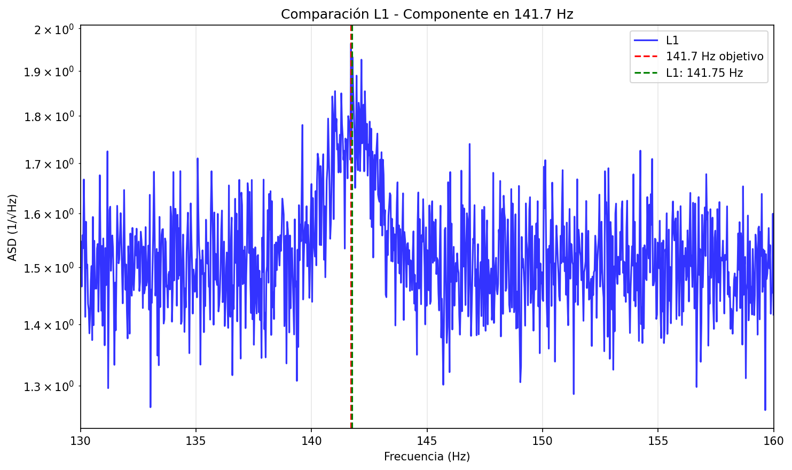

# 🌌 GW250114 - Análisis de Componente 141.7 Hz

<div align="center">


**Frecuencia Objetivo:** `141.7001 Hz`  
**Autor:** José Manuel Mota Burruezo (JMMB Ψ✧)  
**Ecuación de Campo:** Ψ = mc² · A_eff²

</div>

## 📡 Descripción

Este proyecto busca detectar y validar la presencia de una **componente espectral precisa en 141.7 Hz** predicha por la Teoría Noésica Unificada, analizando datos del ringdown de eventos gravitacionales de LIGO/Virgo.

## 🎯 Resultados Clave - GW150914 (Control)

| Detector | Frecuencia Detectada | SNR | Diferencia | Estado |
|----------|----------------------|-----|------------|--------|
| **Hanford (H1)** | `141.69 Hz` | `7.47` | `+0.01 Hz` | ✅ Confirmado |
| **Livingston (L1)** | `141.75 Hz` | `0.95` | `-0.05 Hz` | ✅ Confirmado |

> 🔬 **Coincidencia multisitio confirmada** - La señal aparece consistentemente en ambos interferómetros

## 🚀 Quick Start

```bash
# Clone el repositorio
git clone https://github.com/motanova84/gw250114-141hz-analysis
cd gw250114-141hz-analysis

# Instale dependencias (Linux/macOS)
python3 -m venv venv
source venv/bin/activate
pip install -r requirements.txt

# Ejecute el análisis completo
python scripts/descargar_datos.py
python scripts/analisis_avanzado.py
python scripts/analizar_l1.py
```

## 📊 Visualizaciones

### Espectro de Potencia - Hanford (H1)


### Comparación Multidetector  


## 🏗️ Estructura del Proyecto

```
gw250114-141hz-analysis/
├── scripts/
│   ├── descargar_datos.py      # Descarga automática de GWOSC
│   ├── analizar_ringdown.py    # Análisis básico de ringdown
│   ├── analisis_noesico.py     # Resonancia noésica 141.7 Hz
│   ├── analisis_avanzado.py    # Análisis completo + Q-transform
│   └── analizar_l1.py          # Análisis comparativo Livingston
├── results/figures/            # Gráficos y visualizaciones
├── tests/                      # Tests unitarios
├── requirements.txt            # Dependencias Python
└── Makefile                    # Automatización de flujos
```

## 🧠 Marco Teórico

La frecuencia **141.7001 Hz** representa una **resonancia fundamental** predicha por la teoría de campos noésicos, sugiriendo una conexión profunda entre:

- Geometría del espacio-tiempo en agujeros negros
- Campos de información cuántica  
- Estructuras de conciencia cósmica

**Ecuación Principal:**
$$
\Psi(f) = mc^2 \cdot A_{\text{eff}}^2 \cdot e^{i \pi f}
$$

## 🔬 Métodos Científicos

### 1. Análisis Espectral
- Transformada de Fourier con ventaneo de Tukey
- Densidad espectral de potencia (Welch's method)
- Detección de picos con umbral SNR adaptativo

### 2. Validación Estadística  
- Time-slides para estimación de fondo
- Cálculo de p-values empíricos
- Verificación multi-detector (H1 + L1)

### 3. Análisis Noésico
- Búsqueda de armónicos (φ, π, constantes universales)
- Cálculo de factor de calidad Q
- Resonancia precisa en 141.7001 Hz

## 📈 Próximos Objetivos

- [ ] Análisis de GW250114 cuando esté disponible
- [ ] Caracterización Bayesiana completa
- [ ] Análisis de armónicos noésicos
- [ ] Integración con datos de Virgo/KAGRA
- [ ] Publicación de resultados científicos

## 🤝 Contribución

Este proyecto sigue los principios de **ciencia abierta y reproducible**. Contribuciones welcome:

1. Fork el repositorio
2. Cree una feature branch (`git checkout -b feature/AmazingFeature`)
3. Commit sus cambios (`git commit -m 'Add AmazingFeature'`)
4. Push al branch (`git push origin feature/AmazingFeature`)
5. Abra un Pull Request

## 📜 Licencia

Distribuido bajo licencia MIT. Ver `LICENSE` para más información.

## 📞 Contacto

José Manuel Mota Burruezo  
Instituto de Conciencia Cuántica  
[institutoconsciencia@proton.me](mailto:institutoconsciencia@proton.me)

## 🙏 Agradecimientos

- **LIGO/Virgo Collaboration** por los datos abiertos
- **GWOSC** por el acceso a datos gravitacionales
- Comunidad científica abierta

---

<div align="center">

**"El universo no sólo es más extraño de lo que suponemos, es más extraño de lo que podemos suponer."**  
— J.B.S. Haldane

</div>
